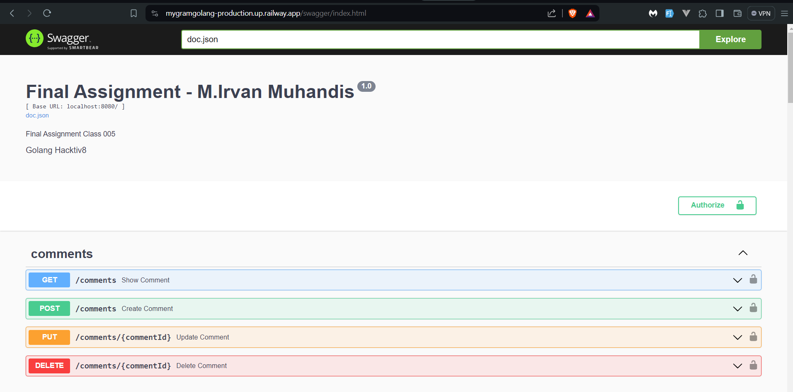

# MyGram

Ini adalah Final Assignment untuk kelas Golang yang diselenggarakan Hacktiv8 Indonesia.

## Deskripsi

Tugas ini mengenai pembuatan REST API MyGram dengan menggunakan bahasa golang. MyGram ialah aplikasi yang dapat menyimpan foto maupun membuat comment untuk foto orang lain. Aplikasi ini akan dilengkapi dengan proses CRUD untuk menjalankan fungsinya. Pada projek ini terdapat 4 tabel, yaitu Users, Photos, Comments, dan Social Medias dimana terdapat relasi sebagai berikut :
- Satu User dapat memiliki banyak photo 
- Satu Photo Dapat Memiliki banyak comment
- Satu User bisa memiliki banyak comment

Adapun API ini memiliki keterangan :
- Autentikasi menggunakan JWT dalam keamanannya
- JWT terenkripsi berisi id USer
- Dokumentasi API dibuat menggunakan swagger
- Deployment dilakukan di Railway (
  [Buka deployment](https://mygramgolang-production.up.railway.app/swagger/index.html ))
  

## Teknologi yang dipakai

- Gin
- GORM
- Golang
- Swagger
- Database Postgres
- Bycrpt Crypto
- Jwt Go
- Go Validator
- Railway
